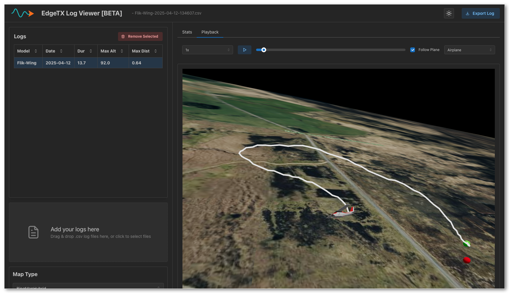

# EdgeTX Log Viewer

A web application for visualizing EdgeTX flight log data.



## Features

*   Upload EdgeTX `.csv` log files.
*   View log data in a table format.
*   Visualize flight paths on a 3D globe.
*   Display key flight statistics.
*   Select specific log entries to view details.
*   Export processed data

## Enable telemetry logs

How to enable telemetry logs on your EdgeTX / OpenTX device

* Blog - [https://oscarliang.com/log-telemetry](https://oscarliang.com/log-telemetry)
* Video - [EdgeTX Setting Up Telemetry Data Logging to your Radio](https://youtu.be/SsbnONkErbc?t=68)

## Building locally

### Prerequisites

*   Node.js
*   Yarn

### Installation

1.  Clone the repository:
    ```bash
    git clone <your-repository-url>
    cd edgetx-log-viewer
    ```
2.  Install dependencies using Yarn:
    ```bash
    yarn install
    ```

### Running the Development Server

To start the application in development mode:

```bash
yarn dev
```

This will start the Vite development server, typically available at `http://localhost:5173`.

### Building for Production

To create a production build:

```bash
yarn build
```

The optimized build files will be located in the `dist` directory.

### Previewing the Production Build

To preview the production build locally:

```bash
yarn preview
```

## License

[MIT License](./LICENSE)